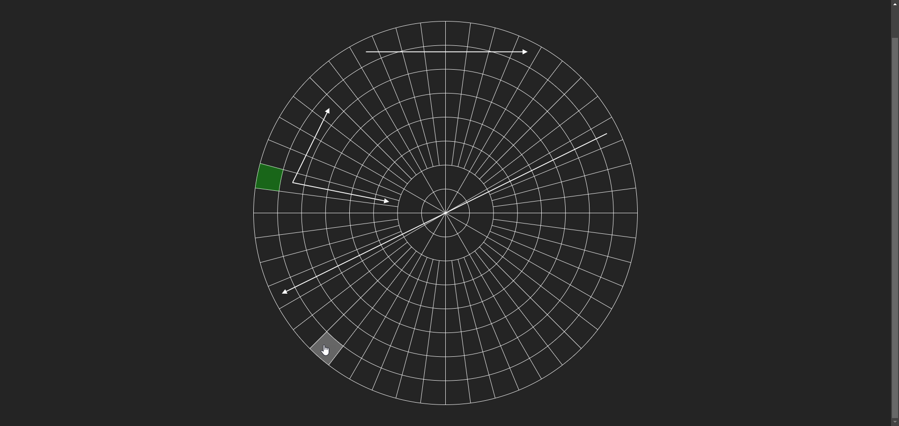

# Radial Demonstrator

# Synopsis
Demonstrates a rudimentary radial graph diagramming tool that allows connections between different sectors of a radial diagram to be plotted. Utilizes a 2D SVG based rendering approach.

## Motivation
Demonstrate a performant means of drawing an interactive polar grid using SVG. Includes irregularly shaped cells toward the middle of the diagram.

## How To Use
- Hover over a sector to highlight it
- Click on a sector to select it
- Click on another sector to connect the two with a line

## Try It Out
Visit the [deployed GitHub Pages site](https://unit2795.github.io/component-collection/?path=/story/radial-grid--default) to try out the live demo

## Installation and Development
- Run `pnpm `install` in the root directory to install dependencies
- Run `pnpm run dev` to start the development server and visit http://localhost:5173/
- Run `pnpm run build` to build the project, open the `dist/index.html` file in your browser to view the production build

## Key Technologies
- React
- TypeScript
- SVG
- Vite